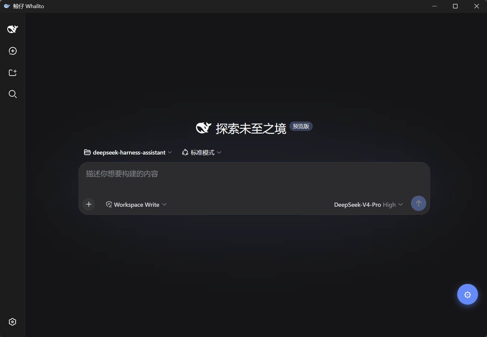

<div align="center">
  
  <h1>鲸仔 · Whalito</h1>
  <p><strong>你的 DeepSeek Harness 桌面助手</strong></p>
  <p>一键安装 · 智能引导 · 常驻托盘 —— 让 AI 助手开箱即用</p>
</div>

---

## 鲸仔是什么

鲸仔（Whalito）是一款为普通用户打造的 DeepSeek Harness 桌面助手。它把原本需要在命令行里才能完成的「安装 Node.js → 安装 Harness → 启动服务」整套流程，简化成几个按钮：打开应用，它会自动检测环境、补齐缺失依赖、启动服务，并在内置窗口中直接打开 Harness。

不需要懂 Node，不需要记命令，开箱即用。

## 📸 界面预览



## ✨ 核心亮点

- **全程引导，告别命令行** —— 打开即自动检测，缺什么装什么，一路点到能用。
- **一键补齐环境** —— Node.js、DeepSeek Harness 缺失或版本过低，自动安装 / 升级。
- **常驻托盘，随开随用** —— 关闭窗口不退出，最小化到托盘；支持开机自启。
- **应用内直达** —— 内置浏览器直接打开 Harness，无需记地址、另开浏览器。
- **状态一目了然** —— 已停止 / 启动中 / 运行中 / 异常实时反馈，日志随时可查。

## 💻 运行环境

鲸仔本身开箱即用，无需手动配置。运行前只需满足以下系统要求：

### 系统要求

| 项目 | 要求 |
| --- | --- |
| 操作系统 | Windows 10（版本 1809 及以上）/ Windows 11 |
| 架构 | x64（64 位） |
| WebView2 Runtime | 首次安装时由安装器自动安装（Windows 11 已内置） |

### DeepSeek Harness 依赖（鲸仔自动处理）

以下依赖由鲸仔自动检测并引导安装，你无需手动配置：

| 依赖 | 要求 | 说明 |
| --- | --- | --- |
| Node.js | ≥ 22.19.0 | 缺失或版本过低时，鲸仔会引导一键安装 / 升级 |
| npm | 随 Node.js 附带 | 用于安装 Harness |
| 网络连接 | 可访问 npm 源 | 首次安装需联网下载依赖 |

## 🚀 快速开始

1. 在 [Releases](https://github.com/entireyu/dsh-launcher/releases) 下载最新安装包 `Whalito_0.2.0_x64-setup.exe`
2. 双击安装（首次运行 Windows SmartScreen 会提示「未知发布者」，点击「仍要运行」即可）
3. 打开鲸仔，其余交给它 —— 检测、补齐、启动全程自动
4. 关闭窗口即最小化到托盘，需要时点击托盘图标唤回

## 功能一览

| 能力 | 说明 |
| --- | --- |
| 环境检测 | 自动识别 Node.js / npm / Harness 是否就绪 |
| 一键安装 Node.js | 支持 winget、nvm、自定义目录便携版 |
| 安装 / 更新 Harness | 支持切换 npm 镜像源，国内更快 |
| 服务器管理 | 一键启动 / 停止 / 重启，异常自动拉起 |
| 托盘常驻 | 最小化到托盘，支持开机自启 |
| 实时日志 | 运行状态与输出实时可见 |

## 🛠 开发者

鲸仔基于 **Tauri 2 + Vue 3 + TypeScript** 构建，Windows 优先。

### 目录结构

```
src/                    # Vue 3 + TS 前端控制面板
src-tauri/
  src/
    lib.rs              # 入口：托盘、窗口、命令注册
    state.rs            # 共享状态、配置、进程 / 日志 / 健康检查
    commands.rs         # 全部 Tauri 命令（检测 / 安装 / 启停 / 设置）
    embed.rs            # 内嵌浏览器窗口
  Cargo.toml
  tauri.conf.json
```

### 本地开发

```bash
pnpm install
pnpm tauri dev        # 前端 dev server + Rust debug
```

### 打包

```bash
pnpm tauri build      # 产出 NSIS 安装器（src-tauri/target/release/bundle/nsis/）
```

> 安装包当前未签名，Windows SmartScreen 会提示「未知发布者」，属预期；正式分发建议配置代码签名证书。

## 🔍 原理：背后的真实命令

鲸仔对用户透明 —— 每个按钮背后执行的命令都清晰可查：

| 动作 | 实际执行 |
| --- | --- |
| 检测 Node | `where.exe node` / `node --version` / 兜底 `C:\Program Files\nodejs\node.exe` |
| 装 Node | `winget install/upgrade OpenJS.NodeJS.LTS`；nvm：`nvm install 22.x` + `nvm use`；便携：下载 node zip 解压到用户目录 |
| 装 / 更新 Harness | `node <npm-cli.js> install -g @deepseek-ai/dsh[ @latest]` |
| 校验 | `node <dsh/bin.js> --version` + `--dump-default-config` |
| 启动 | `node <dsh/bin.js> web --port <port>` |
| 停止 | `taskkill /PID <pid> /T /F` |
| 健康检查 | `GET <解析出的 URL>`（800ms 超时） |
